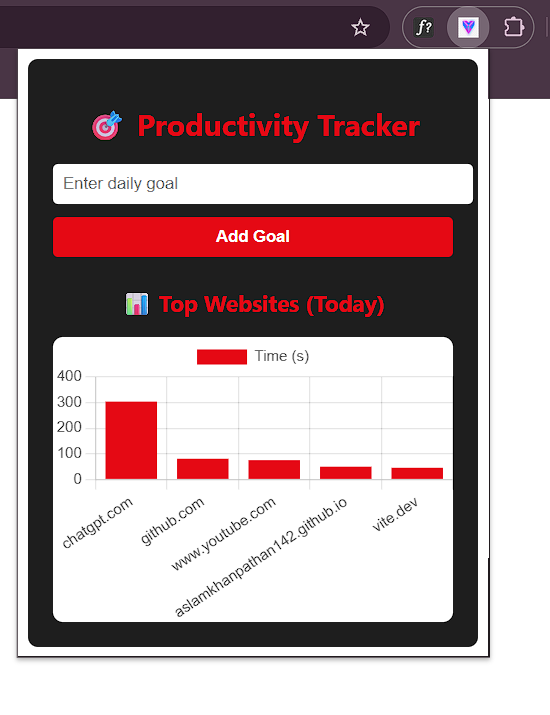

## 🧠 PRODUCTIVITY TRACKER CHROME EXTENSION

**COMPANY:** CODTECH IT SOLUTIONS  

**NAME:** Mo Aslam Khan  

**INTERN ID:** CT08DN1583  

**DOMAIN:** React.js Web Development  

**DURATION:** 8 WEEKS  

**MENTOR:** NEELA SANTOSH

---

## 📄 TASK DESCRIPTION

The Productivity Tracker Chrome Extension is one of the key tasks in my internship at CODTECH IT Solutions. This project focused on developing a real-time Chrome browser extension using React.js and Browser APIs to help users track and enhance their productivity during browsing sessions.

The extension allows users to set daily goals, monitor their time spent on specific websites, and visualize productivity trends. It is built using Manifest V3, making it compatible with modern Chrome requirements. The frontend is crafted using React.js, and data is managed using the chrome.storage API for persistent local storage.

- Users can:

- Set a daily focus goal

- View a timer tracking time spent on active tabs

- Get real-time popups/alerts when productivity goals are exceeded

- See a dashboard with bar charts displaying website usage trends

I implemented modular components, used React Hooks (useEffect, useState) for real-time updates, and styled the UI with a clean and modern look. The extension runs in the background and listens to browser activity using chrome.tabs and chrome.runtime APIs.

---

## 🔧 Technologies Used 
* **React.js** – UI development for the extension popup and dashboard
* **JavaScript (ES6+)** – Logic, timers, and API integrations
* **Chrome Extension APIs** – `chrome.tabs`, `chrome.storage`, `chrome.runtime`
* **Manifest V3** – For defining background service workers
* **HTML & CSS** – Responsive design with smooth transitions
* **Chart.js** – For rendering productivity charts”

---

## ✅ Key Features
* 🎯 **Set Daily Goals** — Define your productivity target for the day
* ⏱️ **Track Website Usage** — Monitors time spent on each website
* 📊 **Visualize Data** — Shows graphs to reflect usage patterns
* 🔔 **Alert System** — Warns users when exceeding time on non-productive sites
* 💾 **Persistent Data** — Stores data in `chrome.storage` across sessions
* 🧩 **Manifest V3 Compliant** — Secure and optimized background behavior
* 📱 **Clean UI** — Responsive layout for the popup and dashboard”

---

## 🛠️ How to Use
1. Clone the repository: `git clone https://github.com/your-username/productivity-tracker-extension`
2. Run build: `npm install && npm run build`
3. Go to **chrome://extensions** in your browser
4. Enable **Developer Mode**
5. Click on **Load Unpacked**
6. Select the `/dist` or `/build` folder
7. Start using your extension!”

---

## 📸 Output

